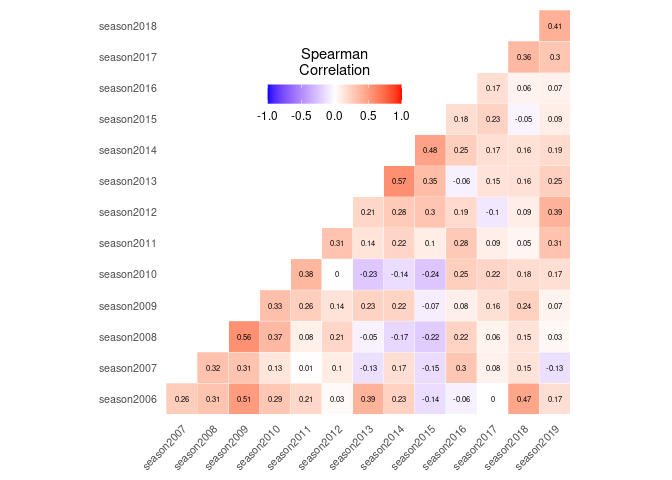
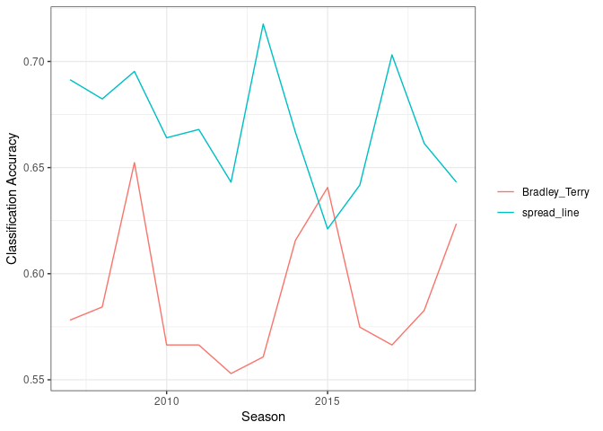

Exploring and Predicting NFL Games Using the Bradley-Terry model
================
Elina Choi, Shan Lu, and Steven Moen

  - [1 Summary](#summary)
  - [2 Introduction](#introduction)
  - [3 Results](#results)
  - [4 Discussion](#discussion)
  - [5 References](#references)

# 1 Summary

TEST

# 2 Introduction

It might be fair to call gridiron football, sometimes called “American”
football, an obsession in the United States, at all levels of play -
high school, college, and professional. The professional ranks generate
eye-popping revenue figures - in 2018, they generated $16 billion (Ojha
2020). This revenue figure doesn’t fully encapsulate the national
phenomenon that is American football. As a native Texan, it’s hard to
explain how big a deal it is in everyday life. Indeed, many of my
fondest memories in high school and college revolved around the sport,
even though I never played it. I played in the marching band in high
school, and even after the games, there was always a buzz about how
Texas or Texas A\&M were doing, and how the BCS rankings were shaping
up. It’s hard not to feel genuine joy or sadness when your team wins -
whether it be jumping for joy as Rice beats Purdue in an upset victory,
or helplessly watching Mississippi State and a young Dak Prescott win
handily in the Liberty Bowl. Football encapsulates a gamut of emotions
that would rival those from even the greatest Shakespeare play within
the 60 minutes on the game clock, and with the ball spotted between the
hash marks on the gridiron. As statisticians, we seek to better
understand this game that, until now, has been quite enigmatic.

There has been an enormous movement in recent years towards improved
sports analytics - how to incorporate modern data analysis tools to
better understand outcomes of games and to help teams improve their
likelihood of a win (Witherspoon 2019). In addition to understanding
what happens on the field and how to improve results from the
perspective of a coach or player, there is also a growing legal sports
betting market in many states. Indeed, there is legal sports betting in
19 states and the District of Columbia as of November 3rd, 2020
(Rodenberg 2020). While this industry was shrouded in secrecy in the
past, it is now becoming more and more a (legitimate) part of game day.

Predicting and analyzing professional American football games played by
the National Football League (NFL) is a tricky business compared to the
other “Big 4” sports leagues, namely, the National Basketball
Association (NBA), the National Hockey League (NHL), and Major League
Baseball (MLB). There are four reasons that make this the case.

  - First off, the NFL only has 16 regular-season games per year, which
    is significantly less than the NHL and NBA’s 82 and the MLB’s 162.
    Clearly, per the sample size alone, predicting NFL games will be
    much more difficult since any standard error will be larger, other
    things equal. Moreover, there are more NFL teams (32) compared to 30
    teams in the other leagues. The scarce levels of data within a
    season make direct win-loss comparisons difficult. A team in a weak
    division (such as the NFC East in 2020, with 8 wins total after Week
    8 in the NFL amongst the four teams in the division) could hardly be
    compared fairly to a division such as the AFC North, with 19 wins
    total in Week 8 for the 4 teams in the division as the 2020 NFL
    season approaches its midway point.

  - Secondly, one might instead point to the margin of victory as a
    means of properly sorting teams. Again, this is misleading - the
    same considerations mentioned above still apply. A mediocre team
    playing a bad team may look better than a great team playing a good
    team. Also, from 2002 through through the 2014 season, about 64% of
    NFL games were within two touchdowns (Langager 2014), and there is a
    very real problem of “garbage time”, where a team that is ahead may
    modify their offensive strategy to chew clock and increase the
    chance of a victory instead of scoring more points, because the
    latter poses a greater risk of a turnover or a fumble (Clay 2012).
    To be sure, it seems quite clear that a team plays to win, not to
    win by a certain margin in the NFL, as this is what matters for
    making the playoffs. As such, margin of victory is also deceptive.

  - Third, one might then look to the microfoundations of the NFL game,
    but the problem there is that the probabilities needed to understand
    the game are highly conditional and therefore intractable compared
    to other sports (Feng 2020), especially at the level of the
    individual player. For example, evaluating quarterbacks Deshaun
    Watson against Patrick Mahomes requires a lot of simplifying
    assumptions since they play very different styles of football under
    different head coaches with a different supporting cast of skill
    position players and offensive linemen.

  - Fourth, there is also the problem of prior year data. To borrow
    Vilfredo Pareto’s phrase (Pareto 1961), there is a lot of
    “circulation of the elite” among NFL teams - a great team may find
    themselves in a cellar quickly, and vice-versa. The NFL draft, with
    its highest picks and therefore best players awarded to the teams
    with the worst records, a team that was awful one year can find its
    fortunes reversed the next (DeArdo 2020). Also, given the high
    injury risks associated with football, players tend to have shorter
    careers compared to their Big 4 peers (Schwartz 2013) and can have a
    promising season cut short or hobbled with an injury.

One might look at these grim realities and give up - how is it possible
to understand America’s game? There is hope, and it comes in the form of
the Bradley-Terry model.

## 2.1 Bradley-Terry Model

The Bradley-Terry model (Bradley and Terry 1952) is a probabilistic
model for pairwise comparison. The probability of event “team i beats
team j” is formulated as


The parameter

quantifies the ability of team *i*. If
,
then team *i* has higher chances of beating team *j*.

are team specific variables that may influence game results. For
example, if we set
,
then 
expresses home team advantage. The model is estimated through maximum
likelihood, and is implemented with R package
[BradleyTerry2](https://github.com/hturner/BradleyTerry2).

# 3 Results

We have NFL data from season 2006 to season 2019, downloaded from Github
folder [Data
source](https://github.com/leesharpe/nfldata/blob/master/DATASETS.md#games).
The data set contains detailed information about game date time,
location, weather, stadium type, coach, game type, team score etc, but
for exploratory purpose, we will model the game result using only team
name and home/away information.

## 3.1 Load data

``` r
dat = read.table('games.csv', sep=',', header=T,  row.names = NULL, fill=T, quote='', stringsAsFactors = FALSE)
dat = dat[dat$season>=2006 &dat$season<2020,]

# remove playoff games
dat = dat[dat$game_type=="REG",]
# remove games with ties
dat <- dat[dat$result!=0,]
# Teams change name in season 2016 and 2017. We use their old names for consistent comparison.
dat$home_team[dat$home_team=="LA"]="STL"
dat$away_team[dat$away_team=="LA"]="STL"
dat$home_team[dat$home_team=="LAC"]="SD"
dat$away_team[dat$away_team=="LAC"]="SD"
```

## 3.2 Check temporal correlation

The data comes as a time series. We expect team’s “ability” varies
through time, because of changes in players, coaches, funding, etc. It
is better to train a predictive model with more recent data, other than
using all the historical data. A common technique to inspect the
temporal structure is through auto-correlation. For each season, we fit
a Bradley-Terry model for each season, and compute the Spearman
correlation of the estimated team score between each pair of seasons. As
the correlation decays fast through years, with a median value of 0.35
between consecutive years, we decide to train the Bradley-Terry model
using only data from the previous season.

``` r
### fit BT by season ###
# BT_score is a matrix storing BT scores for all seasons

BT_score = matrix(NA, nrow = length(unique(dat$home_team)), ncol=length(unique(dat$season)))
# Sort the team names
rownames(BT_score)=sort(unique(dat$home_team))
# Organize the seasons
colnames(BT_score)=paste0('season',min(dat$season): max(dat$season))


# team ARI is used as control
BT_score['ARI',] = 0

# Loop through for all seasons in the data frame
for (i in min(dat$season): max(dat$season)){
  # Subset the data frame for only one season
  dat_season=dat[dat$season==i,]
  # Count a home team win if result is equal to 0
  home.wins = (dat_season$result>0)*1
  # print(home.wins)
  # Assign variables in a different way
  # Create a list of inputs for the model to run
  football = list(home.team=data.frame(team = dat_season$home_team, at.home = 1),
                  away.team=data.frame(team = dat_season$away_team, at.home = 0))
  # print(football)
  # Try running the model
  mod1 = BTm(outcome = home.wins, player1 = home.team, player2 = away.team,
             formula = ~ team + at.home, id = "team",data = football, family =binomial(link = "logit"))
  # Extract the model coefficients
  coef=mod1$coefficients[1:(length(mod1$coefficients)-1)]
  # Stores the coefficients in a list
  BT_score[unlist(lapply(names(coef),function(i){substr(i, 5, nchar(i))})),i-min(dat$season)+1]=coef
}


BT_score = BT_score[complete.cases(BT_score),]
cormat = cor(BT_score, method='spearman')
diag(cormat)=NA

# Reorder the correlation matrix
get_upper_tri <- function(cormat){
  cormat[lower.tri(cormat)]<- NA
  return(cormat)
}
upper_tri <- get_upper_tri(cormat)
# Melt the correlation matrix
melted_cormat <- melt(upper_tri, na.rm = TRUE)
# Create a ggheatmap
ggheatmap <- ggplot(melted_cormat, aes(Var2, Var1, fill = value))+
  geom_tile(color = "white")+
  scale_fill_gradient2(low = "blue", high = "red", mid = "white", 
                       midpoint = 0, limit = c(-1,1), space = "Lab", 
                       name="Spearman\nCorrelation") +
  theme_minimal()+ # minimal theme
  theme(axis.text.x = element_text(angle = 45, vjust = 1, 
                                   size = 8, hjust = 1),
        axis.text.y = element_text(size = 8))+
  coord_fixed()

ggheatmap + 
  geom_text(aes(Var2, Var1, label = round(value,2)), color = "black", size = 2) +
  theme(
    axis.title.x = element_blank(),
    axis.title.y = element_blank(),
    panel.grid.major = element_blank(),
    panel.border = element_blank(),
    panel.background = element_blank(),
    axis.ticks = element_blank(),
    legend.justification = c(1, 0),
    legend.position = c(0.6, 0.7),
    legend.direction = "horizontal")+
  guides(fill = guide_colorbar(barwidth = 7, barheight = 1,
                               title.position = "top", title.hjust = 0.5))
```

<div class="figure" style="text-align: center">



<p class="caption">

Figure 1: Spearman correlation of the team Bradley-Terry score between
each pair of seasons

</p>

</div>

## 3.3 Fit BT model and compare the prediction accuracy with spread line

We separate the dataset by season, train the Bradley-Terry model with
each season from 2006 through 2018, and test the fitted model using the
next season. As shown in figure 2, the Bradley-Terry model with an
average prediction accuracy of 0.59 is better than a random guess, but
performs worse than the spread line with an average accuracy of 0.67.

``` r
season = (min(dat$season)+1):max(dat$season)
# test_acc if a matrix storing testing set classification accuracy of Bradley-Terry model, and spreadline accuracy.
test_acc = matrix(0, nrow=length(season), ncol=2)
colnames(test_acc) = c('Bradley_Terry', 'spread_line')
rownames(test_acc) = paste0('season_', season)

for (i in season){
  # Training set
  dat_train=dat[dat$season==i-1,]
  home.wins = 1*(dat_train$home_score> dat_train$away_score)
  football_train = list(home.team=data.frame(team = dat_train$home_team, at.home = 1),
                  away.team=data.frame(team = dat_train$away_team, at.home = 0))
  mod1 = BTm(outcome = home.wins, player1 = home.team, player2 = away.team,
             formula = ~ team + at.home , id = "team", data = football_train, family = binomial(link = "logit"))
  # Testing set
  dat_test=dat[dat$season==i,]
  football_test = list(home.team=data.frame(team = dat_test$home_team, at.home = 1),
                  away.team=data.frame(team = dat_test$away_team, at.home = 0))

  test_acc[i-min(season)+1,]=c(
  mean((predict(mod1, newdata=football_test)>0)*1 == (dat_test$result>0)*1),
  mean((dat_test$spread_line>0)*1 == (dat_test$result>0)*1)
  )
}
# reshape the test_acc to plot
test_acc_long = gather(data.frame(test_acc, season=rownames(test_acc)), method, accuracy, "Bradley_Terry":"spread_line", factor_key=TRUE)
test_acc_long$season = as.integer(unlist(lapply(test_acc_long$season, FUN=function(i){substr(i,8,11)})))
ggplot(test_acc_long, aes(x=season, y=accuracy, color=method)) + theme_bw()+
    geom_line()+theme(legend.title = element_blank())+ylab('Classification Accuracy')+xlab("Season")
```

<div class="figure" style="text-align: center">



<p class="caption">

Figure 2: Classification accuracy for Bradley-Terry model and spread
line

</p>

</div>

# 4 Discussion

After exploring the data with a simple version of the Bradley-Terry
model, we have a few directions to improve the model:

  - Formulate the Bradley-Terry model in a way that can adjust for ties.
  - Train the model in an online fashion, instead of using large
    batches.
  - Take more explanatory variables into account.
  - Extend the model to account for temporal dynamic, so that we can
    train with all the historical data.

# 5 References

<div id="refs" class="references hanging-indent">

<div id="ref-bradley1952rank">

Bradley, Ralph Allan, and Milton E Terry. 1952. “Rank Analysis of
Incomplete Block Designs: I. The Method of Paired Comparisons.”
*Biometrika* 39 (3/4): 324–45.

</div>

<div id="ref-Clay2012">

Clay, Mike. 2012. “Defining ’Garbage Time’ | PFF News & Analysis | PFF.”
<https://www.pff.com/news/defining-garbage-time>.

</div>

<div id="ref-DeArdo2020">

DeArdo, Bryan. 2020. “Is the Super Bowl hangover real? How past losers
have fared next season, what it means for the 49ers - CBSSports.com.”
<https://www.cbssports.com/nfl/news/is-the-super-bowl-hangover-real-how-past-losers-have-fared-next-season-what-it-means-for-the-49ers/>.

</div>

<div id="ref-Feng2020">

Feng, Ed. 2020. “The football analytics resource guide – the top 9
killer articles.” <https://thepowerrank.com/top-analytics-articles/>.

</div>

<div id="ref-Langager2014">

Langager, Chad. 2014. “What is the Most Common Margin Of Victory In The
NFL? - SportingCharts.com.”
<https://www.sportingcharts.com/articles/nfl/what-is-the-most-common-margin-of-victory-in-the-nfl.aspx>.

</div>

<div id="ref-Ojha2020">

Ojha, Jay. 2020. “The 10 biggest sports leagues in the world by revenue
| Pledge SportsPledge Sports.”
<https://www.pledgesports.org/2020/02/the-10-biggest-sports-leagues-in-the-world-by-revenue/>.

</div>

<div id="ref-Pareto1961">

Pareto, Vilfredo. 1961. “The circulation of elites.” In *Talcott
Parsons, Theories of Society; Foundations of Modern Sociological Theory,
2 Vol.*, 551–57. The Free Press of Glencoe, Inc.
[https://archive.org/stream/theoriesofsociet01pars{\\\#}page/550/mode/2up](https://archive.org/stream/theoriesofsociet01pars%7B\\#%7Dpage/550/mode/2up).

</div>

<div id="ref-Rodenberg2020">

Rodenberg, Ryan. 2020. “The United States of sports betting - Where all
50 states stand on legalization.”
[https://www.espn.com/chalk/story/{\\\_}/id/19740480/the-united-states-sports-betting-where-all-50-states-stand-legalization](https://www.espn.com/chalk/story/%7B\\_%7D/id/19740480/the-united-states-sports-betting-where-all-50-states-stand-legalization).

</div>

<div id="ref-Schwartz2013">

Schwartz, Nick. 2013. “The average career earnings of athletes across
America’s major sports will shock you | For The Win.”
<https://ftw.usatoday.com/2013/10/average-career-earnings-nfl-nba-mlb-nhl-mls>.

</div>

<div id="ref-Witherspoon2019">

Witherspoon, Andrew. 2019. “NBA three-pointers are leading the sports
analytics revolution - Axios.”
<https://www.axios.com/three-pointers-lead-sports-analytics-revolution-b5613e67-92fe-44a3-897e-ede6780f0edb.html>.

</div>

</div>
